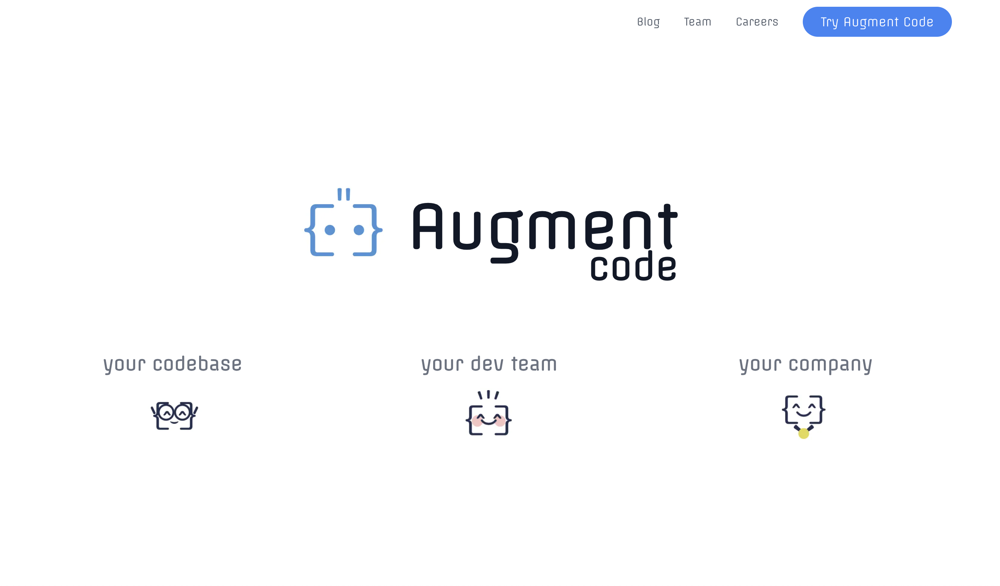
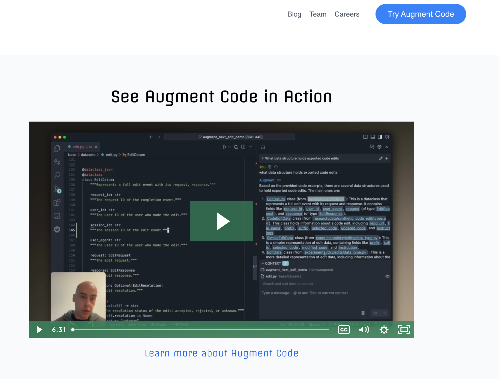
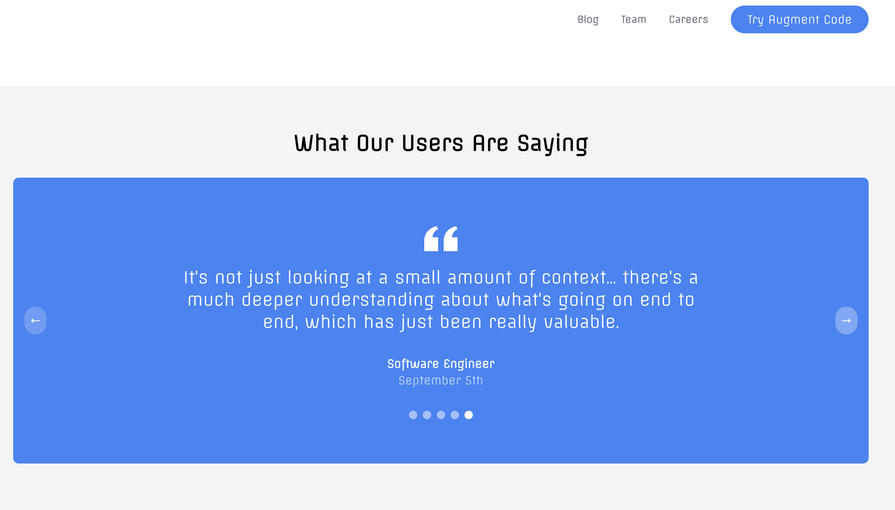
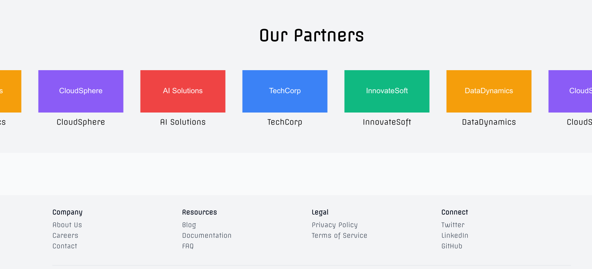

# Augment Code

Augment Code is a developer tool for teams that helps developers write better code faster using AI-powered suggestions and code completions. A pair programmer that lives inside your IDE and works at the speed of thought.

## Built With

- [Next.js](https://nextjs.org/) - The React framework for production
- [React](https://reactjs.org/) - A JavaScript library for building user interfaces
- [Tailwind CSS](https://tailwindcss.com/) - A utility-first CSS framework
- [TypeScript](https://www.typescriptlang.org/) - Typed JavaScript at Any Scale
- [Augment Code](https://www.augmentcode.com/) - The Developer AI that deeply understands your codebase
- [Claude 3.5 Sonnet](https://www.anthropic.com) - Advanced AI model for natural language processing

## Hosting

This website is hosted on [Vercel](https://vercel.com/), a cloud platform for static sites and Serverless Functions.

## Live Demo

Check out the landing page: <a href="https://augment-azure.vercel.app/" target="_blank" rel="noopener noreferrer">Augment Code</a>

## Features

- Landing page with interactive hero section featuring a blinking robot animation
- User testimonials carousel
- Augment product video demo
- Features showcase highlighting codebase, dev team, and company benefits
- Responsive design for mobile and desktop views
- Header with navigation and call-to-action button
- Footer with company info and useful links

## Getting Started

These instructions will get you a copy of the project up and running on your local machine for development and testing purposes.

### Installation

1. Clone the repository:

   ```
   git clone https://github.com/yourusername/augment-codes.git
   ```

2. Navigate to the project directory:

   ```
   cd augment-codes
   ```

3. Install dependencies:

   ```
   npm install
   ```

4. Start the development server:

   ```
   npm run dev
   ```

5. Open [http://localhost:3000](http://localhost:3000) in your browser to view the application.


## Feature Requests

Here are some features that are being considered for future updates:

- Add: gif showing code generation examples, e.g. "Generate a React component", "Write unit tests for this component"
- ~~Add: Marketing Section: billboard ads~~
- Add: Blog Section: experience using Augment with some pros and cons
- Add: 3D interactive Augment Robot on landing page (Blender 3D, After Effects)

### How to Request a Feature

We welcome feature requests from the community! If you have an idea for a new feature or improvement:

1. Go to the [Issues](https://github.com/yourusername/augment-codes/issues) tab of this repository.
2. Click on "New Issue".
3. Choose "Feature request" if available, or use a blank issue.
4. Provide a clear title and detailed description of the feature you'd like to see.
5. Submit the issue.

Your request will be reviewed and considered for future development. Thank you for helping make Augment Code better!

## License

This project is licensed under the MIT License - see the [LICENSE.md](LICENSE.md) file for details

## Acknowledgments

- This project is a clone of the [Augment Code](https://www.augmentcode.com/) website, created for educational purposes and to showcase web development skills.
- The original design and concept belong to Augment Code.
- Additional features, modifications, and improvements are my own work.
- This project is not affiliated with or endorsed by Augment Code.

## Screenshots

### Landing Page








